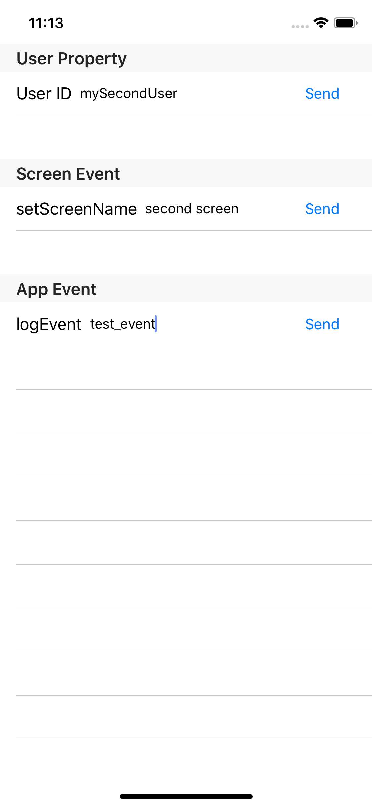
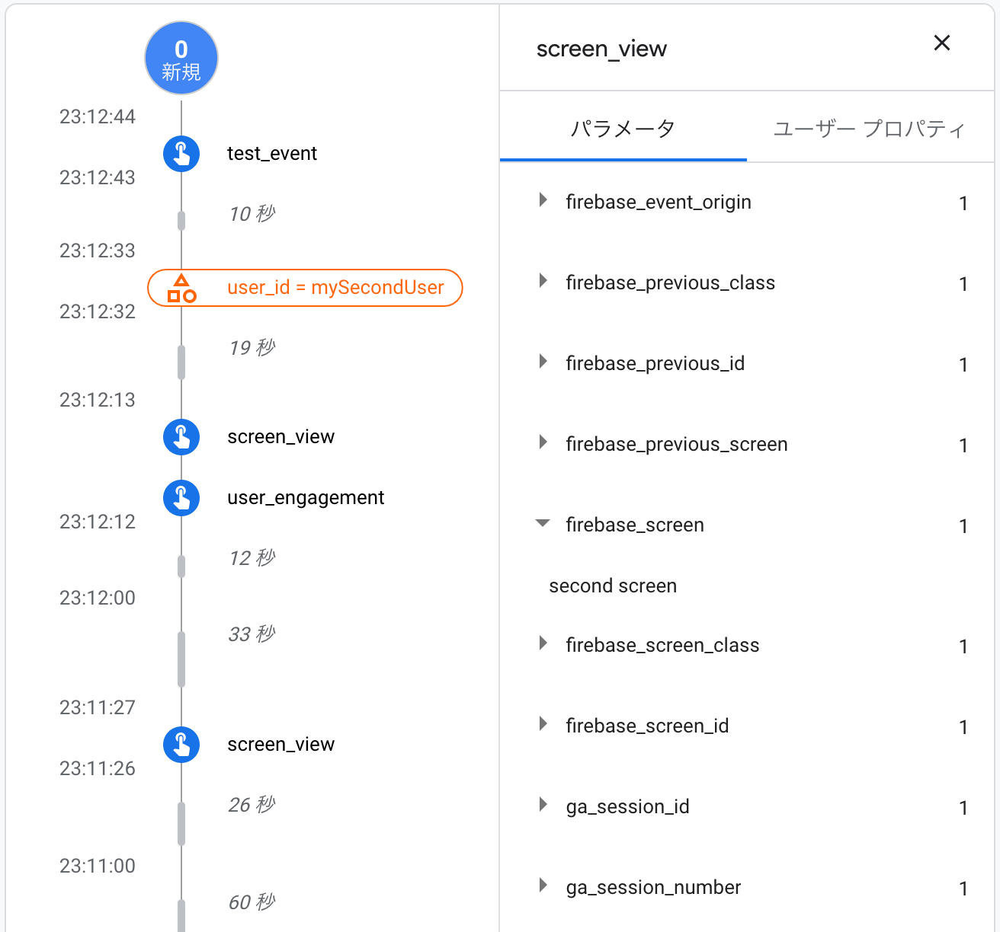

# FABQPractice

A quite simple event sender.

## How to use

1. clone this repogitory
1. Add GoogleService-Info.plist
1. You need to change TEAM ID and APP IDENTIFIER (because You already have created a Firebase Project to check events).
1. Run!
1. Check events on Firebase Console DebugView (Debug mode is already enabled).

